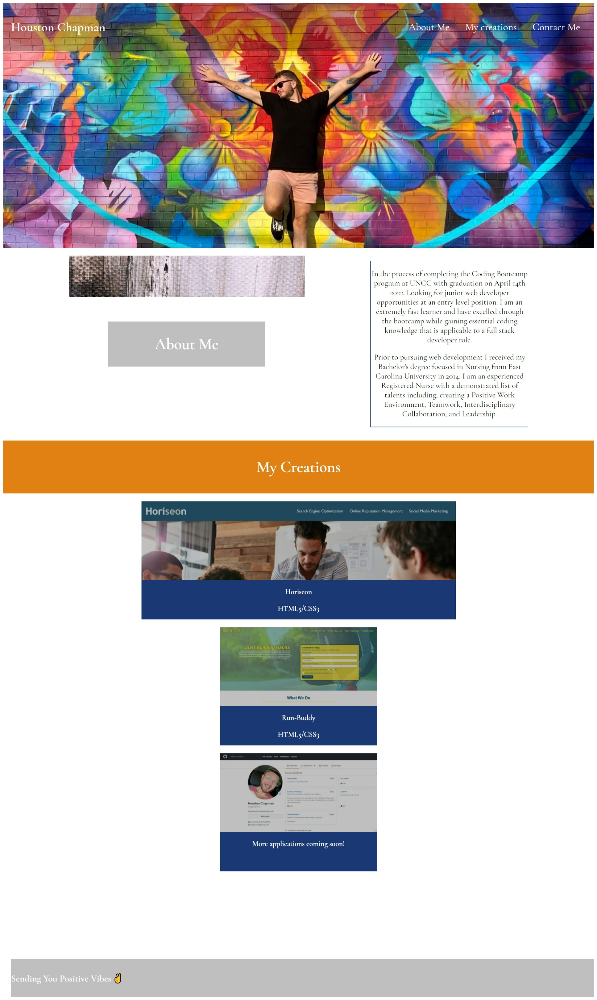

# Portfolio

## Demonstrating my abilities using HTML and Advanced CSS

This repository will show you my everchanging portfolio expressing my abilities as a web developer

Currently this repository contains: 

- HTML structured in a meaningful way that shows a fun and interactive page for the user
- Advanced CSS displayed in an attractive layout

### [Access the site by this link!](https://chapmanh10.github.io/portfolio/)

